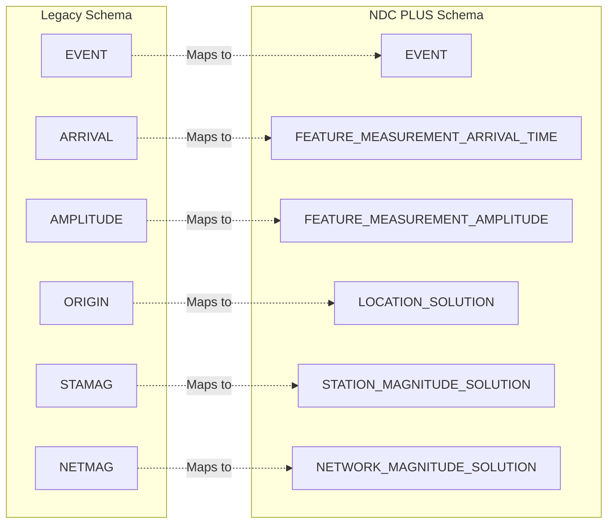

# SchemaTest3 - NDC PLUS and Legacy Database Schema Documentation (CLONE)

⚠️ **IMPORTANT: This is a clone/fork repository with modified AWS resource names to prevent conflicts with the original deployment.**

A comprehensive database schema management system with visual documentation for both the **Legacy** and **NDC PLUS** seismic monitoring systems, presented with GitHub integration similar to Swagger for APIs.

## 📊 Overview

This repository maintains both Legacy and NDC PLUS Oracle database schemas with rich visual documentation rendered directly in GitHub. The schemas support seismic event monitoring, waveform analysis, and location determination with clear separation and cross-schema integration mapping.

**Key Features**:
- 📄 **Dual Source Schemas**: Legacy (17 tables) and NDC PLUS (35 tables) table definitions
- 🔄 **Enhanced Parser**: Python tool to extract and process both schema formats
- 📋 **Unified JSON Schema**: Machine-readable schema specification for both systems
- 📊 **Dual Visual Documentation**: Mermaid diagrams showing relationships within and between schemas
- 🎨 **Enhanced Browser Interface**: Tabbed schema viewer with cross-schema navigation
- 🔗 **Cross-Schema Mapping**: Clear identification of conceptual relationships between Legacy and NDC PLUS tables

## 🗂️ Repository Structure

```
SchemaTest2/
├── Legacy_tables.txt           # Legacy schema definition (17 tables)
├── NDC_PLUS_tables.txt         # NDC PLUS schema definition (35 tables)
├── tools/
│   └── parse_schema.py         # Enhanced dual-schema parser and doc generator
├── schema/
│   ├── docs/
│   │   ├── DUAL_SCHEMA.md      # Comprehensive dual-schema documentation
│   │   └── dual-schema-viewer.html # Interactive dual-schema browser
│   └── dual_schema.json        # Machine-readable dual-schema specification
└── README.md                    # This file
```

## 📖 Documentation

### 🔍 View Complete Dual Schema Documentation

**[📊 Dual Schema Documentation](schema/docs/DUAL_SCHEMA.md)**

The documentation includes:
- ✅ **Schema Comparison**: Side-by-side comparison of Legacy vs NDC PLUS
- ✅ **Cross-Schema Integration**: Mermaid diagrams showing conceptual mappings
- ✅ **Separated Table Categories**: Organized by functional area for each schema
- ✅ **Detailed Specifications**: Complete column information for all 52 tables
- ✅ **Relationship Diagrams**: Both intra-schema and inter-schema relationships
- ✅ **Oracle-Specific Support**: Handles different Oracle data type formats

### 🎨 Interactive Dual Schema Browser

**[🌐 Open Dual Schema Viewer](schema/docs/dual-schema-viewer.html)** (requires local server)

A enhanced Swagger-like interface for browsing both schemas:
- **Tabbed Interface**: Switch between Legacy and NDC PLUS schemas
- **Categorized Navigation**: Tables organized by functional groups
- **Search Functionality**: Find tables quickly across both schemas
- **Cross-Schema References**: Clear indication of table mappings
- **Professional Styling**: Modern, responsive design


### 📊 Updated Schema Statistics

- **Legacy Tables**: 17 (traditional seismic analysis)
- **NDC PLUS Tables**: 35 (modern event processing)
- **Total Combined**: 52 tables
- **Cross-Schema Mappings**: 8 conceptual relationships
- **Database Type**: Oracle (both systems)

## 🔗 Cross-Schema Integration

The repository provides clear separation between Legacy and NDC PLUS schemas while highlighting their relationships:

### Schema Mapping Overview

| Legacy System | NDC PLUS System | Relationship Type |
|---------------|-----------------|-------------------|
| EVENT | EVENT | Direct conceptual mapping |
| ARRIVAL | FEATURE_MEASUREMENT_ARRIVAL_TIME | Enhanced measurement system |
| AMPLITUDE | FEATURE_MEASUREMENT_AMPLITUDE | Enhanced measurement system |
| ORIGIN | LOCATION_SOLUTION | Enhanced location processing |
| ASSOC | SIGNAL_DETECTION_HYPOTHESIS | Advanced signal detection |
| STAMAG/NETMAG | STATION/NETWORK_MAGNITUDE_SOLUTION | Enhanced magnitude calculation |

### Key Differences

- **Legacy**: Traditional ID-based foreign keys (NUMBER types)
- **NDC PLUS**: Modern UUID-based relationships (RAW(16) types)
- **Legacy**: 17 tables focused on core seismic analysis
- **NDC PLUS**: 35 tables with advanced processing capabilities

### Updated Relationship Overview



## 🚀 Getting Started

### Prerequisites

- Python 3.6+ (for schema parser)
- Oracle Database (for deploying the schema)
- Git (for version control)

### Regenerating Documentation

```bash
# Run the enhanced dual-schema parser
python tools/parse_schema.py

# This generates:
# - schema/dual_schema.json (machine-readable dual schema)
# - schema/docs/DUAL_SCHEMA.md (comprehensive documentation)  
# - schema/docs/dual-schema-viewer.html (interactive browser)
```

### View Documentation

```bash
# Option 1: View Markdown documentation
open schema/docs/DUAL_SCHEMA.md

# Option 2: Launch interactive dual-schema HTML viewer
cd schema/docs
python3 -m http.server 8000
# Then visit: http://localhost:8000/dual-schema-viewer.html
```

## 🔧 Technical Details

### Enhanced Parser Features

The enhanced parser (`tools/parse_schema.py`) now supports:
- **Dual Schema Processing**: Handles both Legacy and NDC PLUS formats
- **Cross-Schema Relationship Detection**: Identifies conceptual mappings
- **Enhanced JSON Output**: Structured format with schema separation
- **Comprehensive Documentation**: Detailed markdown with visual diagrams
- **Format Support**: Different table definition formats for each schema

---

*This repository demonstrates modern database documentation practices with clear schema evolution tracking and comprehensive cross-system integration mapping.*

If you modify the schema or need to regenerate documentation:

1. **Clone the repository**:
   ```bash
   git clone https://github.com/jwehlen-cell/SchemaTest1.git
   cd SchemaTest1
   ```

2. **Update the source schema** (if needed):
   ```bash
   # Edit NDC_PLUS_tables.txt with your changes
   nano NDC_PLUS_tables.txt
   ```

3. **Run the schema parser**:
   ```bash
   python3 tools/parse_schema.py
   ```

4. **View generated documentation**:
   - JSON Schema: `schema/ndc_plus_schema.json`
   - Markdown Docs: `schema/docs/NDC_PLUS_SCHEMA.md`

### Using the Schema Parser

The `parse_schema.py` tool automatically:
- ✅ Parses the text-based schema file
- ✅ Extracts table and column definitions
- ✅ Identifies foreign key relationships
- ✅ Generates JSON schema documentation
- ✅ Creates comprehensive Markdown documentation with diagrams

```bash
# Run the parser
cd SchemaTest1
python3 tools/parse_schema.py

# Output:
# ✓ Found 35 tables
# ✓ Found 35 relationships
# ✓ Generated JSON schema
# ✓ Generated Markdown documentation
```

## 📋 Schema Organization

### Table Categories

#### 1️⃣ Channel & Waveform Data
Tables for managing seismic waveform data and channel segments:
- `CHANNEL_SEGMENT` - Time series channel segment information
- `CHANNEL_SEGMENT_CREATION` - Creation metadata
- `CHANNEL_SEGMENT_PROC_MASK_XREF` - Processing mask cross-references
- `CHANNEL_SEGMENT_WAVEFORM` - Waveform ID linkage
- `STATION_CHANNEL` - Station and channel configuration

#### 2️⃣ Event Management
Core tables for seismic event tracking:
- `EVENT` - Master event table
- `EVENT_HYPOTHESIS` - Event characteristic hypotheses
- `EVENT_HYPOTHESIS_TAG` - Event classifications
- `EVENT_STATUS_INFO` - Workflow status
- `EVENT_CORRELATION` - Event correlation analysis
- `EVENT_CORRELATION_CHANNEL_SEGMENT` - Correlation channel data

#### 3️⃣ Feature Measurements & Predictions
Signal analysis and predictions:
- Measurement tables for amplitude, arrival time, numeric, and enumerated features
- Prediction tables for arrival time, components, and numeric features

#### 4️⃣ Location & Magnitude
Geographic location and magnitude calculations:
- Location solutions with uncertainty representations
- Network and station-level magnitude solutions

## 🔍 Key Features

### Visual Documentation (Swagger-like)

Similar to how Swagger provides interactive API documentation, this repository provides:

- ✅ **Entity Relationship Diagrams**: Visual representation using Mermaid
- ✅ **Categorized Tables**: Organized by functional domain
- ✅ **Detailed Specifications**: Complete column information with types
- ✅ **Relationship Tracking**: Foreign key identification and visualization
- ✅ **Machine-Readable Format**: JSON schema for automation
- ✅ **GitHub Native Rendering**: No external tools needed to view

### GitHub Integration Benefits

- **Native Rendering**: Mermaid diagrams render directly in GitHub
- **Version Control**: Full history of schema changes
- **Pull Requests**: Review schema modifications before merging
- **Search**: Find tables and columns using GitHub search
- **Issues**: Track schema enhancements and bugs
- **Automation**: CI/CD can validate schema changes

## 🛠️ Usage Examples

### For Developers

```python
# Load and use the JSON schema
import json

with open('schema/ndc_plus_schema.json', 'r') as f:
    schema = json.load(f)

# Get table information
for table_name, table_info in schema['tables'].items():
    print(f"Table: {table_name}")
    print(f"Description: {table_info['description']}")
    print(f"Columns: {len(table_info['columns'])}")
```

### For DBAs

```sql
-- The schema uses Oracle-specific types
-- Example: UUID columns use RAW(16)
-- Example: Timestamps use TIMESTAMP(6)

-- Review table structure
DESC CHANNEL_SEGMENT;

-- Check relationships
SELECT * FROM USER_CONSTRAINTS 
WHERE CONSTRAINT_TYPE = 'R';
```

### For Documentation

- Link to `schema/docs/NDC_PLUS_SCHEMA.md` in project docs
- Reference JSON schema for API contract validation
- Embed Mermaid diagrams in wiki pages or presentations

## 📈 Schema Evolution

To modify the NDC PLUS schema:

1. **Update source file**: Edit `NDC_PLUS_tables.txt` with table changes
2. **Regenerate docs**: Run `python3 tools/parse_schema.py`
3. **Review changes**: Check generated JSON and Markdown
4. **Commit changes**: Use git to track modifications
5. **Submit PR**: Request review of schema changes
6. **Document**: Update version history in documentation

## 🤝 Contributing

1. Fork the repository
2. Create a feature branch (`git checkout -b feature/add-table`)
3. Make your schema changes to `NDC_PLUS_tables.txt`
4. Regenerate documentation: `python3 tools/parse_schema.py`
5. Commit your changes with clear messages
6. Submit a pull request

## 🔧 Schema Parser Features

The `parse_schema.py` tool provides:
- **Smart Parsing**: Handles Oracle-specific formatting
- **Relationship Detection**: Identifies foreign keys by naming patterns
- **Category Assignment**: Groups tables by functional domain
- **Description Generation**: Provides meaningful table descriptions
- **Type Mapping**: Maps Oracle types to JSON schema types
- **Validation**: Ensures consistency in schema structure

## 📝 Oracle Data Types

The schema uses standard Oracle data types:
- `RAW(16)` - Binary UUIDs for primary/foreign keys
- `VARCHAR2(n)` - Variable-length character strings
- `TIMESTAMP(6)` - High-precision timestamps
- `NUMBER(18)` - Large numeric values
- `BINARY_FLOAT` - Single-precision floating point
- `CLOB` - Large text objects

## 🔗 Related Resources

- [Mermaid Diagram Syntax](https://mermaid.js.org/)
- [JSON Schema Specification](https://json-schema.org/)
- [Oracle Database Documentation](https://docs.oracle.com/en/database/)
- [GitHub Markdown Guide](https://guides.github.com/features/mastering-markdown/)

---

**About NDC PLUS**: The National Data Center PLUS system is designed for comprehensive seismic event monitoring, waveform analysis, and location determination. This schema supports real-time and historical analysis of seismic data.