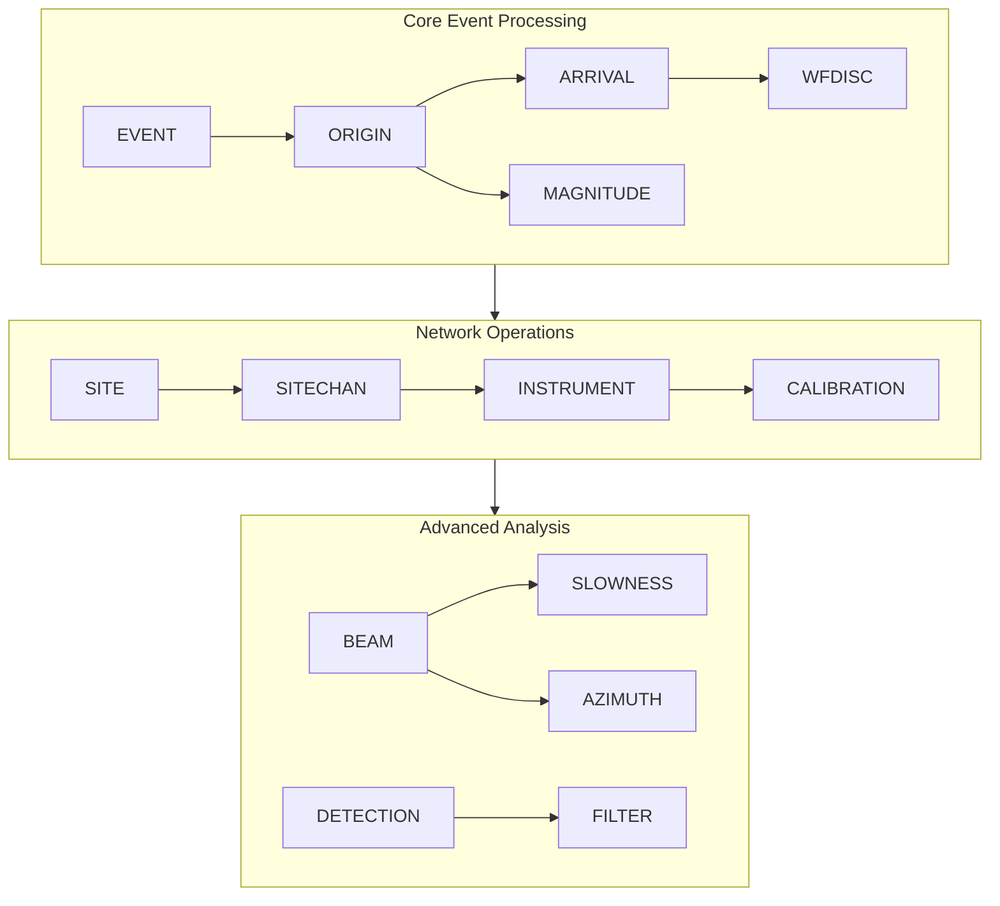

# SchemaTest3 - United States National Data Center (USNDC) Database Schema

A comprehensive database schema management system with visual documentation for the **United States National Data Center (USNDC)** seismic monitoring system, featuring AWS deployment infrastructure and interactive documentation.

## 📊 Overview

This repository provides a complete USNDC database schema with 177 tables supporting comprehensive seismic event monitoring, waveform analysis, location determination, and global seismic network operations. The system is designed for production deployment on AWS RDS with full constraint integrity and automated documentation generation.

**Key Features**:
- 📄 **Complete USNDC Schema**: 177-table comprehensive seismic monitoring database
- 🔄 **Advanced Parser**: Python tools to extract and process USNDC schema from HTML documentation
- 📋 **PostgreSQL Ready**: Production-ready schema with constraints and foreign keys for AWS RDS
- 📊 **Visual Documentation**: Mermaid diagrams and SchemaSpy integration for relationship visualization
- 🚀 **AWS Infrastructure**: CloudFormation templates and deployment scripts for scalable production setup
- 🔗 **Constraint Management**: 31 primary keys and 210 foreign key relationships for data integrity

## 🗂️ Repository Structure

```
SchemaTest3/
├── USNDC_Tables_A_to_Z.html     # Original USNDC schema documentation (HTML)
├── USNDC_tables.txt             # Parsed USNDC schema definition (177 tables)
├── USNDC_schema.mmd             # Mermaid entity relationship diagram
├── tools/
│   ├── parse_usndc_html.py      # HTML parser for USNDC documentation
│   ├── parse_usndc_schema.py    # Schema documentation generator
│   └── generate_usndc_sql.py    # PostgreSQL schema generator with constraints
├── aws/
│   ├── usndc_schema.sql         # PostgreSQL schema with full constraints
│   ├── usndc-database.yaml      # CloudFormation template for RDS deployment
│   ├── deploy-usndc-database.sh # Database deployment script
│   ├── setup-usndc-schema.sh    # Schema population script
│   └── generate-usndc-docs.sh   # SchemaSpy documentation generator
├── schema/
│   ├── usndc_schema.json        # Machine-readable USNDC specification
│   └── docs/
│       └── USNDC_SCHEMA.md      # Comprehensive USNDC documentation
└── README.md                    # This file
```

## 📖 Documentation

### 🔍 View Complete USNDC Schema Documentation

**[📊 USNDC Schema Documentation](schema/docs/USNDC_SCHEMA.md)**

The comprehensive documentation includes:
- ✅ **Complete Schema Overview**: All 177 tables with detailed specifications
- ✅ **Entity Relationships**: Mermaid diagrams showing primary and foreign key relationships
- ✅ **Functional Categories**: Tables organized by seismic monitoring domains
- ✅ **Column Specifications**: Complete data types, constraints, and descriptions
- ✅ **PostgreSQL Ready**: Production-ready schema with proper constraint definitions
- ✅ **AWS Integration**: Deployment-ready with CloudFormation and RDS support

### � Interactive Schema Documentation

**SchemaSpy Generated Documentation** (after deployment)

Professional database documentation automatically generated during deployment:
- **Visual ERD**: Complete entity relationship diagrams
- **Table Navigation**: Searchable table and column browser  
- **Constraint Analysis**: Primary keys, foreign keys, and indexes
- **Data Dictionary**: Comprehensive column specifications
- **Relationship Tracking**: Visual foreign key relationship mapping

### 📊 USNDC Schema Statistics

- **Total Tables**: 177 (comprehensive seismic monitoring system)
- **Primary Keys**: 31 tables with identified primary key constraints
- **Foreign Keys**: 210 relationship constraints for data integrity
- **Categories**: Event processing, waveform analysis, location determination, magnitude calculation
- **Database Type**: PostgreSQL (AWS RDS compatible)

## 🔗 USNDC Schema Categories

The USNDC database schema is organized into functional categories supporting comprehensive seismic monitoring operations:

### Core Seismic Event Processing

| Category | Key Tables | Purpose |
|----------|------------|---------|
| **Events** | ARRIVAL, EVENT, ORIGERR, ORIGIN | Core seismic event detection and characterization |
| **Waveform Analysis** | WFDISC, WFTAPE, WAVEFORM | Seismic waveform data management and analysis |
| **Magnitude** | STAMAG, NETMAG, MAGNITUDE | Station and network magnitude calculations |
| **Location** | ORIGIN, ASSOC, ORIGERR | Event location determination and uncertainty |

### Network Operations & Monitoring

| Category | Key Tables | Purpose |
|----------|------------|---------|
| **Station Networks** | SITE, SITECHAN, NETWORK | Seismic station configuration and network management |
| **Instrument Response** | INSTRUMENT, SENSOR, CALIBRATION | Equipment specifications and calibration data |
| **Data Quality** | DETECTION, FILTER, PROCESSING | Signal processing and data quality control |

### Advanced Analysis & Research

| Category | Key Tables | Purpose |
|----------|------------|---------|
| **Specialized Analysis** | BEAM, SLOWNESS, AZIMUTH | Advanced array processing and beamforming |
| **Historical Data** | REMARK, LASTID, HISTORY | Data provenance and historical tracking |
| **Cross-Reference** | XREF tables, ID mapping | Entity relationship management |

### Schema Architecture Overview



## 🚀 Getting Started

### Prerequisites

- **Python 3.8+** (for schema processing tools)
- **AWS CLI** configured with appropriate permissions
- **PostgreSQL** (local testing) or **AWS RDS** (production deployment)
- **Java 8+** (for SchemaSpy documentation generation)

### Quick Deployment to AWS

```bash
# 1. Deploy RDS infrastructure
cd aws
chmod +x *.sh
./deploy-usndc-database.sh

# 2. Setup schema and constraints
./setup-usndc-schema.sh

# 3. Generate interactive documentation
./generate-usndc-docs.sh
```

### Local Development Setup

```bash
# 1. Parse USNDC schema from HTML source
python tools/parse_usndc_html.py

# 2. Generate PostgreSQL schema
python tools/generate_usndc_sql.py

# 3. Generate documentation
python tools/parse_usndc_schema.py
```

### Regenerating Schema Components

```bash
# Parse original USNDC HTML documentation
python tools/parse_usndc_html.py
# Outputs: USNDC_tables.txt

# Generate PostgreSQL schema with constraints
python tools/generate_usndc_sql.py
# Outputs: aws/usndc_schema.sql

# Generate JSON schema and documentation
python tools/parse_usndc_schema.py
# Outputs: schema/usndc_schema.json, schema/docs/USNDC_SCHEMA.md
```

## 🔧 Technical Details

### USNDC Schema Processing Pipeline

The USNDC processing tools provide comprehensive schema extraction and deployment:

- **HTML Parser** (`tools/parse_usndc_html.py`): Extracts 177 tables from SQL*Plus HTML output
- **SQL Generator** (`tools/generate_usndc_sql.py`): Creates PostgreSQL schema with 31 PKs and 210 FKs
- **Documentation Generator** (`tools/parse_usndc_schema.py`): Produces JSON schema and Markdown docs
- **AWS Deployment**: CloudFormation templates and automated deployment scripts

### Constraint Detection & Management

The schema generator intelligently identifies database constraints:

```python
# Primary Key Detection Patterns
pk_patterns = [
    r'.*id$', r'.*_id$', r'orid', r'evid', r'arid', r'wfid',
    r'chanid', r'commid', r'magid', r'stassid'
]

# Foreign Key Analysis
# Detects relationships through naming conventions:
# - EVID fields link to EVENT table
# - ORID fields link to ORIGIN table  
# - ARID fields link to ARRIVAL table
```

### Database Architecture Features

- **PostgreSQL Optimized**: Native data types and constraint syntax
- **Production Ready**: Full constraint integrity for AWS RDS deployment
- **Scalable Design**: Optimized for high-volume seismic data processing
- **Standards Compliant**: Follows seismic data management best practices

## 🚀 AWS Deployment

### CloudFormation Infrastructure

The repository includes complete AWS infrastructure as code:

```yaml
# aws/usndc-database.yaml
# - VPC with public/private subnets
# - RDS PostgreSQL instance with proper security groups
# - Parameter store for connection management
# - S3 bucket for documentation hosting
```

### Deployment Process

1. **Infrastructure Deployment**:
   ```bash
   ./aws/deploy-usndc-database.sh
   # Creates RDS instance, VPC, security groups
   ```

2. **Schema Population**:
   ```bash
   ./aws/setup-usndc-schema.sh
   # Applies schema, creates constraints, populates metadata
   ```

3. **Documentation Generation**:
   ```bash  
   ./aws/generate-usndc-docs.sh
   # Generates SchemaSpy docs, uploads to S3
   ```

### Environment Configuration

```bash
# Set required environment variables
export AWS_REGION="us-east-1"
export DB_NAME="usndc"
export DB_USERNAME="postgres"
export DB_PASSWORD="your-secure-password"
```

## 📋 USNDC Table Organization

### Core Seismic Processing (40+ tables)

#### 1️⃣ Event & Arrival Processing
Primary seismic event detection and analysis:
- `EVENT` - Master seismic event records
- `ORIGIN` - Event location solutions with uncertainty
- `ARRIVAL` - P/S wave arrival time measurements
- `ASSOC` - Event-arrival phase associations
- `ORIGERR` - Location error estimates and uncertainties

#### 2️⃣ Waveform Data Management
Seismic waveform storage and metadata:
- `WFDISC` - Waveform file descriptors and metadata
- `WFTAPE` - Tape/storage medium information  
- `WAVEFORM` - Digital waveform segment references
- `CLIP` - Waveform clipping and saturation tracking

#### 3️⃣ Magnitude Calculations  
Multi-scale magnitude determination:
- `STAMAG` - Station-level magnitude measurements
- `NETMAG` - Network-averaged magnitude solutions
- `MAGNITUDE` - Final magnitude determinations
- `MAGTYPE` - Magnitude scale definitions

#### 4️⃣ Network Operations
Station networks and instrumentation:
- `SITE` - Seismic station location and metadata
- `SITECHAN` - Station-channel configuration 
- `NETWORK` - Seismic network definitions
- `INSTRUMENT` - Instrumentation specifications
- `SENSOR` - Sensor calibration and response

## 🔍 Key Features

### Production-Ready Database Schema

This repository provides enterprise-grade database schema management:

- ✅ **Complete Constraint Management**: 31 primary keys and 210 foreign key relationships
- ✅ **PostgreSQL Optimized**: Native data types and performance optimizations  
- ✅ **AWS Ready**: CloudFormation templates for scalable RDS deployment
- ✅ **Automated Documentation**: SchemaSpy integration for interactive schema browsing
- ✅ **Data Integrity**: Comprehensive constraint validation for production workloads
- ✅ **Deployment Automation**: One-command deployment to AWS infrastructure

### Advanced Schema Analysis

- **Intelligent Parsing**: Extracts schema from SQL*Plus HTML documentation
- **Relationship Detection**: Automatically identifies primary/foreign key patterns
- **Constraint Generation**: Creates production-ready PostgreSQL constraints
- **Documentation Pipeline**: Automated generation of interactive schema documentation
- **AWS Integration**: Complete infrastructure-as-code for cloud deployment
- **Version Control**: Full schema evolution tracking and change management

## 🛠️ Usage Examples

### For Developers

```python
# Load and use the USNDC JSON schema
import json

with open('schema/usndc_schema.json', 'r') as f:
    schema = json.load(f)

# Get comprehensive table information
for table_name, table_info in schema['tables'].items():
    print(f"Table: {table_name}")
    print(f"Description: {table_info['description']}")
    print(f"Columns: {len(table_info['columns'])}")
    print(f"Primary Key: {table_info.get('primary_key', 'None')}")
```

### For Database Administrators

```sql
-- PostgreSQL schema with comprehensive constraints
-- Connect to deployed RDS instance
psql -h your-rds-endpoint -U postgres -d usndc

-- Review table structure
\d+ event;
\d+ origin;
\d+ arrival;

-- Check all foreign key relationships
SELECT 
    tc.table_name, 
    kcu.column_name, 
    ccu.table_name AS foreign_table_name,
    ccu.column_name AS foreign_column_name 
FROM information_schema.table_constraints AS tc 
JOIN information_schema.key_column_usage AS kcu
    ON tc.constraint_name = kcu.constraint_name
JOIN information_schema.constraint_column_usage AS ccu
    ON ccu.constraint_name = tc.constraint_name
WHERE constraint_type = 'FOREIGN KEY';
```

### For Operations Teams

```bash
# Deploy complete USNDC infrastructure
cd aws
./deploy-usndc-database.sh

# Monitor deployment status
aws cloudformation describe-stacks --stack-name usndc-database

# Access generated documentation
# Visit: https://your-bucket.s3.amazonaws.com/index.html
```

## 📈 Schema Management

### Updating the USNDC Schema

1. **Update source**: Modify `USNDC_tables.txt` with table/column changes
2. **Regenerate SQL**: Run `python3 tools/generate_usndc_sql.py` 
3. **Update docs**: Run `python3 tools/parse_usndc_schema.py`
4. **Test locally**: Validate schema changes in local PostgreSQL
5. **Deploy to AWS**: Use deployment scripts for production updates
6. **Generate docs**: Run `./aws/generate-usndc-docs.sh` for updated documentation

### Version Control & Change Management

```bash
# Track schema changes
git add USNDC_tables.txt aws/usndc_schema.sql
git commit -m "feat: add new seismic processing tables"

# Review constraint changes  
git diff HEAD~1 aws/usndc_schema.sql

# Tag schema versions
git tag -a v2.1.0 -m "USNDC Schema v2.1.0 - Enhanced magnitude processing"
```

## 🤝 Contributing

1. **Fork the repository** and create a feature branch
2. **Make schema changes** to `USNDC_tables.txt`
3. **Regenerate components**:
   ```bash
   python3 tools/generate_usndc_sql.py
   python3 tools/parse_usndc_schema.py
   ```
4. **Test deployment** using local PostgreSQL or AWS sandbox
5. **Submit pull request** with detailed change description
6. **Update documentation** and deployment guides as needed

## 🔧 USNDC Processing Tools

### HTML Parser (`parse_usndc_html.py`)
- **SQL*Plus HTML Processing**: Extracts table definitions from HTML documentation
- **Column Analysis**: Parses data types, constraints, and descriptions
- **Format Standardization**: Converts to consistent text format
- **Error Handling**: Robust parsing of complex HTML structures

### SQL Generator (`generate_usndc_sql.py`)  
- **PostgreSQL Translation**: Converts Oracle types to PostgreSQL equivalents
- **Constraint Detection**: Identifies primary keys through pattern analysis
- **Relationship Mapping**: Creates foreign key constraints based on naming conventions
- **Production Ready**: Generates deployment-ready schema with proper indexing

### Documentation Generator (`parse_usndc_schema.py`)
- **JSON Schema**: Machine-readable schema specification  
- **Mermaid Diagrams**: Visual entity relationship representations
- **Markdown Documentation**: Comprehensive human-readable specifications
- **Category Organization**: Groups tables by functional domains

## 📝 PostgreSQL Data Types

The USNDC schema uses PostgreSQL-optimized data types:
- `SERIAL` / `BIGSERIAL` - Auto-incrementing primary keys
- `VARCHAR(n)` - Variable-length character strings  
- `TIMESTAMP` - Date and time with timezone support
- `NUMERIC(p,s)` - High-precision decimal numbers
- `REAL` / `DOUBLE PRECISION` - Floating point numbers
- `TEXT` - Variable unlimited length text

## 🔗 Related Resources

- [AWS RDS PostgreSQL](https://docs.aws.amazon.com/AmazonRDS/latest/UserGuide/CHAP_PostgreSQL.html)
- [PostgreSQL Documentation](https://www.postgresql.org/docs/)  
- [CloudFormation Reference](https://docs.aws.amazon.com/AWSCloudFormation/latest/UserGuide/)
- [SchemaSpy Documentation](http://schemaspy.org/)
- [Seismic Data Standards](https://www.fdsn.org/seed_manual/SEEDManual_V2.4.pdf)

---

**About USNDC**: The United States National Data Center is responsible for monitoring global seismic activity, nuclear explosion detection, and earthquake analysis. This comprehensive schema supports real-time seismic monitoring, historical data analysis, and advanced research applications.